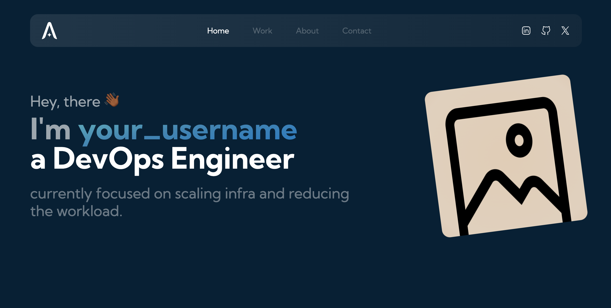
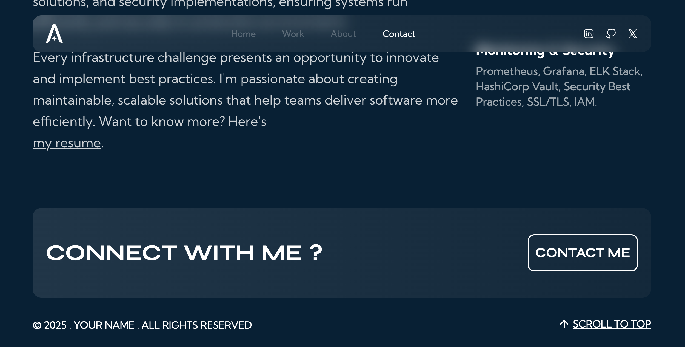

# Community Portfolio

A modern, responsive portfolio website built with Next.js 14, React 18, and Tailwind CSS. Features smooth animations powered by Framer Motion and a beautiful, interactive UI.

## Features

- 🚀 Built with Next.js 14 and React 18
- 💨 Tailwind CSS for styling
- 🎭 Framer Motion animations
- 📱 Fully responsive design
- 🌓 Custom cursor effects with Blobity
- 📧 Contact form integration with EmailJS
- ⚡ Optimized with Vercel Analytics and Speed Insights
- 🎨 Modern and clean UI/UX
- 🔍 SEO optimized

## Gallery




## Prerequisites

Before you begin, ensure you have the following installed:
- Node.js (v18 or higher)
- npm

## Getting Started

1. Clone the repository:
```bash
git clone https://gitlab.com/k.ujjwal1/portfolio.git
```

2. Navigate to the project directory:
```bash
cd community_project
```

3. Install dependencies:
```bash
npm install
```

4. Create a `.env` file in the root directory and add your environment variables:
```env
# Example environment variables (check .env.example)
NEXT_PUBLIC_EMAILJS_SERVICE_ID=your_service_id
NEXT_PUBLIC_EMAILJS_TEMPLATE_ID=your_template_id
NEXT_PUBLIC_EMAILJS_PUBLIC_KEY=your_public_key
```

5. Start the development server:
```bash
npm run dev
```

Open [http://localhost:3000](http://localhost:3000) in your browser to see the result.

## Project Structure

```
community_portfolio/
├── app/                    # Next.js app directory
│   ├── components/        # React components
│   ├── contexts/         # React contexts
│   └── utils/           # Utility functions
├── public/              # Static assets
└── contexts/           # Global context providers
```

## Build and Deployment

To build the project for production:

```bash
npm run build
```

To start the production server:

```bash
npm start
```
# Build the image
```bash
docker build -t community-portfolio .
```

# Run the container
```bash
docker run -p 3000:3000 community-portfolio
```


## Contributing

This is an open-source project, and contributions are welcome! Feel free to:
1. Fork the repository
2. Create your feature branch (`git checkout -b feature/amazing-feature`)
3. Commit your changes (`git commit -m 'Add some amazing feature'`)
4. Push to the branch (`git push origin feature/amazing-feature`)
5. Open a Pull Request

## License

This project is licensed under the MIT License - see the [LICENSE](LICENSE) file for details.

## Feedback

If you have any feedback or suggestions, please open an issue in the repository. We appreciate your input!
